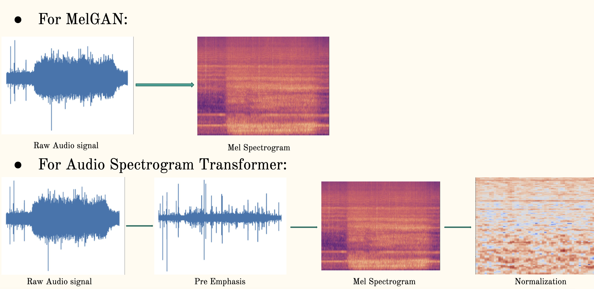
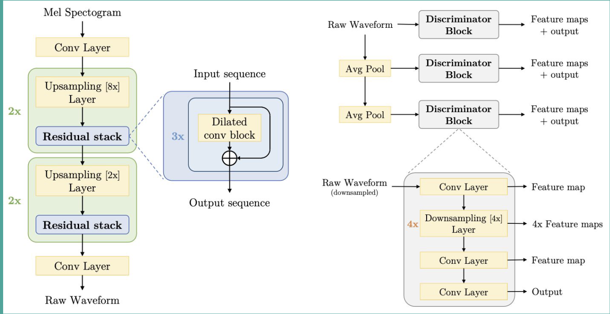
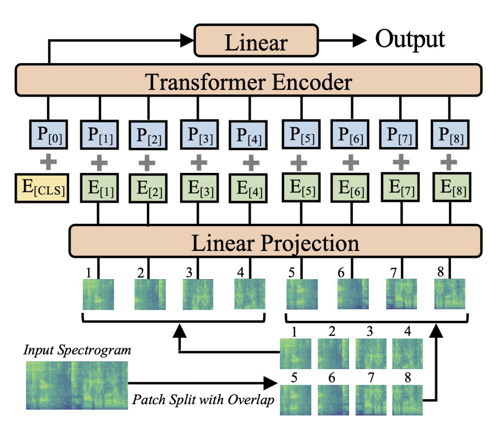

# A Novel Approach to Underwater Acoustic Target Classification with MelGAN and Audio Spectrogram Transformer

This work implements Audio Spectrogram Transformer on ShipsEar Database (A private underwater vessel noise database) which serves as the benchmark for various models on underwater noise classification. Training Dataset was expanded by generation of synthetic audio samples using MelGAN.

- Refer to the document for further details 📖

## Data Format


## MelGAN
Architecture of MelGAN , Generator on the left and Discriminator on the right.

## Audio Spectrogram Transformer
Architecture of AST.


## Code 
```bash
-data_sampler.ipynb -- This notebook contains code for converting raw audio files of the database into suitable formats and lengths for training AST

-melgan.ipynb -- This notebook contains the implementation of MelGAN for generating synthetic audio samples. This notebooks has to be run for each class of the database seperately.

-train_test.ipynb -- This notebook splits both the real and synthetic data into train, validation and test splits. we suggest to run this code for each class of the database seperately for mitigating class imbalance.

-ast.ipynb -- This notebook contains the implementation of AST.
```

## Contribution and Funding
- This work is done in collaboration with Indian Institute of Technology Palakkad.
- IIT Palakkad Technology Hub has funded the project.

## References
if you find this work useful, please cite this repository:
```bash
@software{Budagam_A_Novel_Approach_2024,
author = {Budagam Devichand and Manikandan Sabarimalai},
month = may,
title = {{A Novel Approach to Underwater Acoustic Target Classification with MelGAN and Audio Spectrogram Transformer}},
url = {https://github.com/devichand579/Underwater_acoustic_target_classification},
year = {2024}
}
```


